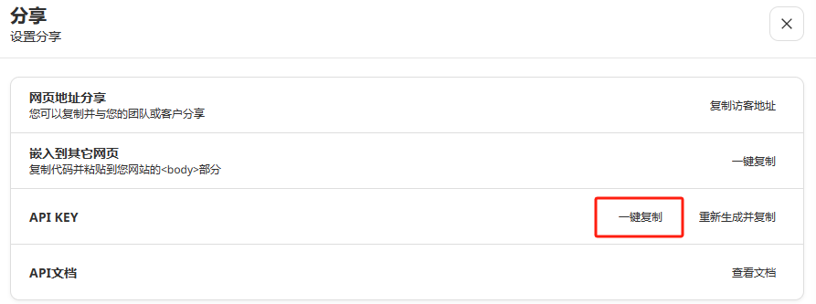

# CHAT_API

## API 调用

1. 对话接口

    - 接口：POST /de/api/chat

    - 请求参数说明:

```json
{
  "apiKey": "apiKey", 
  "userInput": "你好"
}
```
        apiKey: 在 管理后台 - 智能客服管理 - 分享连接 - API KEY 处点击意见复制获取
        userInput: 用户输入



    - 返回结果:

```json
{
  "msg": "您好，我是一个语言模型，可以回答您的问题和提供建议。您有什么需要帮助的吗？",
  "code": 200
}
```

```json
{
  "msg": "非常抱歉，我还没学到相关知识。",
  "code": 200
}
```